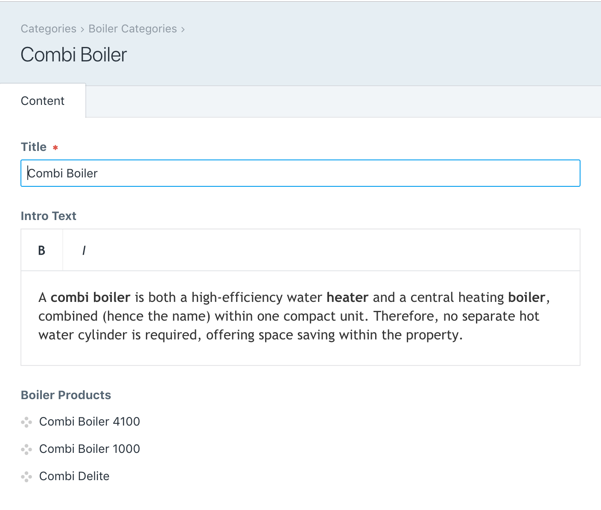

# Sort Elements plugin for Craft CMS 3.x & 4.x

Field to sort related elements that have already been defined.

## Requirements

This plugin requires Craft CMS 3.0.0-beta.23 or later.

## Installation

To install the plugin, follow these instructions.

1. Open your terminal and go to your Craft project:

        cd /path/to/project

2. Then tell Composer to load the plugin:

        composer require ournameismud/sortelements

3. In the Control Panel, go to Settings → Plugins and click the “Install” button for Sort Elements.

## Sort Elements Overview

Sort Elements creates a custom field for defining a custom order for elements that have already got a relationship established. 

## Configuring Sort Elements

Configuration is done in the field type where you are limited to specifying the element type that this field will be used to sort.

## Using Sort Elements

Sort Elements creates a custom field for defining a custom order for elements that have already got a relationship established. 

For example Pro Boilers™ wants to categorise their products set up in a Products channel. You set up the product categories and assign them to the individual product entries but having done this they also want to sort the order that certain products are shown in. 

We don't want to set up this relationship twice which is where the plugin comes in. We create a field type for our category that lets us sort the elements that are already related to it (from either entries, categories, assets, tags or users). Once we add our field, when editing the category we can then sort these and the field will output an array for use in our front-end templates.

To use in twig the field will simply output an array of ids. So with the above example we can fetch and sort our products like so:

    

    

The `fixedOrder` property is needed to respect the order of the ids in the array.
By default (eg if the sort order has not been saved for a particular category) the field will return `null`. In this instance the entries query (or whatever element the field is tied to) will be returned based on any other properties defined (eg the `section` or if you want to set a relationship, eg  `{ relatedTo: category }`).

## Sort Elements Roadmap

Some things to do, and ideas for potential features:

* Look into updating with element save, eg if entry related to category field in category updated.

Brought to you by [@cole007](http://ournameismud.co.uk/)
Icon created by ProSymbols from the Noun Project
